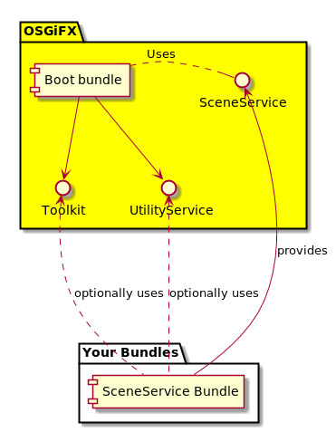

## FlexFX

| Branch | Master | Dev |
|:--------:|:--------:|:-----:|
| Build Status |  | |

FlexFX is the combination on JavaFX with the modularity offered by the OSGi specifications and its implementations.
Frameworks such as DromblerFX which provide a rich set of GUI widgets and a standard GUI framework. FlexFX doesn't attempt to offer this but instead removes the complexity of handling JavaFX within OSGi but places fewer demands on how you create your FX components and their look.

JavaFX isn't OSGi-friendly 'out of the box'. That is it was never designed with the OSGi modularity in mind. This presents a few technical challenges that must be overcome and enforces some specific application architecture. Further technical details can be found [here](documentation/README.md)

#### Quickstart

1. Implement the [`SceneService`](boot/src/main/java/com/javatechnics/flexfx/scene/SceneService.java) interface in your bundle and offer it as an OSGi service by what ever means suited to your project. `SceneService` provides to FlexFX the root node of your scene. You can build your Scene either by instantiating Nodes through code or inflating an FXML file.
2. Deploy the FlexFX bundle.
3. Deploy your own bundle(s).

    

#### Examples
Code examples can be found [here](examples/README.md)