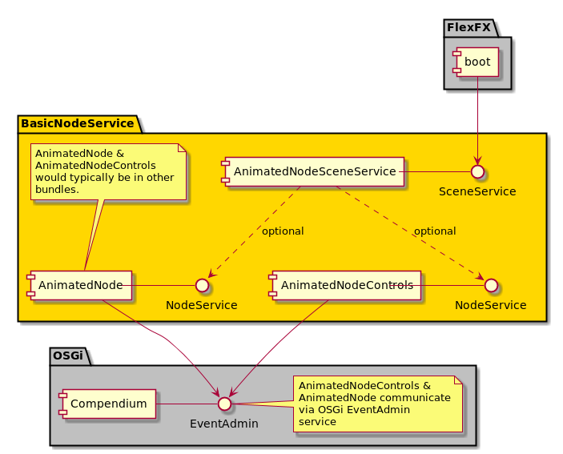

### Basic-Node-Service
This examples demonstrates how to provide a SceneService that itself listens for NodeServices which it dynamically loads/unload into its scene.

  
    

It should be noted that is something of a contrived example in that NodeServices would be typically offered by other bundles. There is no benefit of offering Nodes within the same bundle as services.

The SceneService implementation (AnimatedNodeSceneService) is instantiated via Blueprint and also it registers a service listener for NodeService. In this example NodeServices are marked as 'availability=optional' otherwise the bean would not be created as the node services are within the same bundle. It is however feasible for node services to be mandatory should an implementation choose that. In this case the SceneService would not be registered with the OSGi framework until a NodeService was available.

Two NodeServices are instantiated via Blueprint `AnimatedNode` and `AnimatedNodeControls` and both inflate their XML layout using the `UtilityService.populateWrapper()` method. These two NodeServices are used by `AnimatedNodeSceneService` via the `bindNodeService()` method and are passed through to the `SceneServiceController` which is in effect a regular FXML controller class.

Of the two NodeService implementations `AnimatedNodeControls` passes commands to `AnimatedNode` via the OSGi `EventAdmin` service. `AnimatedNode` acts upon these commands which are either speed or animation effects. The two NodeServices are decoupled from one another. Note that the two classes `AnimatedNode` and `AnimatedNodeControls` are 'OSGi-aware' wrappers around the 'FXML-aware' controllers `AnimatedNodeController` and `AnimatedControlsController`. 
## Installation

The basic-node-service bundle can be installed into Karaf from your local repository via:

`install mvn:com.javatechnics.flexfx/boot/${version}`

`install mvn:com.javatechnics.flexfx/basic-node-service/${version}`

replacing `${version}` as appropriate.